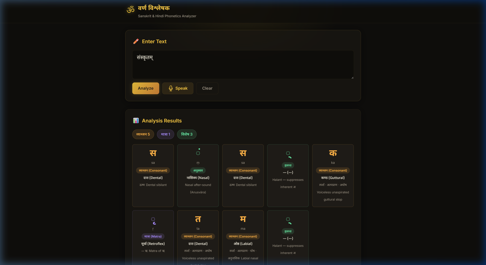

# 🕉️ वर्ण विश्लेषक — Sanskrit Phonetics Analyzer

A lightweight, responsive web application for analyzing **Sanskrit and Hindi phonetics**. Type or speak Devanagari text and instantly see a character-by-character breakdown showing vowel/consonant classification, place of articulation, aspiration, voicing, and IAST romanization.



---

## ✨ Features

- **Character-level Analysis** — Break down any Devanagari text into individual characters with detailed phonetic information
- **Vowel & Consonant Classification** — Identify each character as स्वर (Vowel), व्यञ्जन (Consonant), मात्रा (Matra), or special marks
- **Place of Articulation** — See where each sound is produced: कण्ठ (Guttural), तालु (Palatal), मूर्धा (Retroflex), दन्त (Dental), ओष्ठ (Labial)
- **Speech-to-Text Input** — Speak in Hindi/Sanskrit and the app transcribes and analyzes your speech (requires Chrome/Edge + localhost)
- **Built-in Sound Database** — Interactive grid of 50+ Devanagari sounds with hover tooltips and filter pills
- **Educational Section** — Learn about vowels, consonants, the five places of articulation, aspiration (अल्पप्राण/महाप्राण), and voicing (घोष/अघोष)
- **Graceful Handling** — Unrecognized characters are highlighted without breaking the analysis
- **Mobile-Friendly** — Fully responsive design that works on phones, tablets, and desktops

---

## 🛠️ Tech Stack

| Technology | Purpose |
|---|---|
| HTML5 | Semantic structure |
| CSS3 | Dark gold theme, glassmorphism, animations |
| Vanilla JavaScript | Phonetics engine, database, Web Speech API |
| Google Fonts | Inter + Noto Sans Devanagari |

**Zero dependencies. No build step. Works offline** (except speech input which needs internet).

---

## 🚀 Getting Started

### Option 1: Open directly
Simply open `index.html` in your browser. Text analysis works immediately.

### Option 2: Local server (needed for speech input)
```bash
# Using npx
npx serve .

# Or using Python
python -m http.server 3000
```
Then open [http://localhost:3000](http://localhost:3000)

---

## 📖 Sanskrit Phonetics — Quick Reference

### Places of Articulation (उच्चारण स्थान)

| Place | Sanskrit | English | Example Sounds |
|---|---|---|---|
| कण्ठ | कण्ठ्य | Guttural (Throat) | अ, आ, क-वर्ग, ह |
| तालु | तालव्य | Palatal (Hard palate) | इ, ई, च-वर्ग, य, श |
| मूर्धा | मूर्धन्य | Retroflex (Roof) | ऋ, ट-वर्ग, र, ष |
| दन्त | दन्त्य | Dental (Teeth) | ऌ, त-वर्ग, ल, स |
| ओष्ठ | ओष्ठ्य | Labial (Lips) | उ, ऊ, प-वर्ग |

### Sound Categories
- **स्वर (Vowels):** अ आ इ ई उ ऊ ऋ ॠ ऌ ॡ ए ऐ ओ औ
- **स्पर्श (Stops):** क–म (25 consonants across 5 vargas)
- **अन्तस्थ (Semi-vowels):** य र ल व
- **ऊष्म (Sibilants/Fricatives):** श ष स ह

---

## 📂 Project Structure

```
├── index.html     # Main HTML page
├── style.css      # Styling — dark theme with gold accents
├── app.js         # Phonetics database + analysis engine + speech API
├── screenshot.png # App screenshot
└── README.md      # This file
```

---

## 📝 License

This project is open source and available for educational purposes.

---

<p align="center">
  Built with ❤️ for Sanskrit &amp; Hindi phonetics education
</p>
